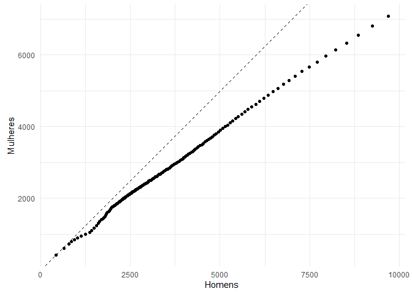

## Sobre o repositório

A ideia aqui é demonstrar uma simples rotina de trabalho de dados com o R, realizando uma análise exploratória nos microdados da RAIS (Relação Anual de Informações Sociais).
O intuito é mostrar os passos desde a extração de uma base de dados, à criação e transformação de variáveis necessárias para análises, usando comandos que possam ser compreendidos 
de forma a serem replicados e/ou modificados em outras bases de dados. 

Outro ponto a esclarecer é que existem multiplos pacotes no R para fazer a mesma tarefa, ou comandos distintos que possibilitam os mesmos objetivos
que exponho aqui. O que demonstro aqui é apenas uma forma.

Por que usei a RAIS? Esta é uma informação consolidada de um grupo populacional (simplificando a análise, já que não terei que fazer nenhuma inferência estatística), é um 
banco de dados bem estruturado (com informações completas) e uma quantidade de linhas grande o suficiente para justicar o uso do R. 


### Baixando e estruturando os microdados

Os microdados da RAIS são disponibilizadas pelo Programa de Disseminação das Estatísticas do Trabalho (PDET/MTE) e podem ser acessadas pelo ftp
[ftp://ftp.mtps.gov.br/pdet/microdados/](ftp://ftp.mtps.gov.br/pdet/microdados/) (recomendo o uso do FileZilla para navegar pelos diretórios do PDET). O Ftp também disponibiliza 
um arquivo de _layout_, que contém o dicionário dos dados.

Um outro canal onde se pode obter os dados é a [Base dos Dados](https://basedosdados.org/dataset/3e7c4d58-96ba-448e-b053-d385a829ef00?table=86b69f96-0bfe-45da-833b-6edc9a0af213), que por utilizar o 
Google BigQuery, torna o processo de ETL bem leve e rápido. Entretanto, como quero expor alguns comandos de extração de dados no R, vou deixar este processo para um outro momento 
(o vídeo do [Rocha Data in R](https://www.youtube.com/watch?v=6D7CGphDwqc&ab_channel=RochaDatainR) explana bem a extração dos dados da RAIS a partir da **Base dos Dados**).

O processo a seguir consiste em i. baixar o arquivo compactado para um diretório temporário, ii. extrair e por fim iii. ler os dados brutos. Como os 
arquivos são muito grandes e pesados, este processo leva um certo tempo. Todavia
uma opção mais célere é fazer diretamente os passos i. e ii., sem os comandos do R. Também caso se queira com dados de vários anos ou estados simultaneamente, recomendo
seguir os passos disponibilizados por **Matheus Stivali**, podendo ser acessados [aqui](https://rpubs.com/mstivali/RAIS1).


```r
dim(dado)
```

```
## [1] 13873188       60
```
O objeto _dado_ é um data.frame com 13.873.188 linhas e 60 colunas e que contém as informações de vínculos de trabalho dos estados da região sul. 
Os passos a seguir resume-se em formatar os nomes dos vetores e criar a variável _uf_ (a partir do código IBGE do município),
 em vista que sintetizarei a análise a apenas ao estado de Santa Catarina.


```r
dim(dado)
```

```
## [1] 4249448      60
```

Ao fim, o df _dado_ ficou com 4.249.448 linhas e 61 colunas.

### Análises de contingência simples

Nesta seção focaremos em comandos para realizar uma análise em variáveis qualitativas nominais.

Sobre a natureza dos dados da RAIS, ela contém dados sobre postos de trabalho no mercado formal em determinado ano. No caso aqui,
pode-se afirmar portanto que no decorrer do ano de 2024 existiram 4.249.448 postos de trabalho formal, mas como alguns indivíduos foram 
desligados no decorrer do ano e outros (ou o mesmo) foram admitidos. Para saber a real força de trabalho formal no estado, utiliza-se 
a variável *vinculo_ativo_31/12*, que determina quantas pessoas (e cargos) existiam ao fim do ano de referência. Uma forma de se obter isso é 
tabulando esse vetor, que totaliza 2.545.564 vínculos ativos em 2024 no estado. 


```r
table(dado$`vinculo_ativo_31/12`)
```

```
## 
##       0       1 
## 1703884 2545564
```

O banco de dados fornece diversas variáveis qualitativas dos indivíduos, como sexo, faixa etária, nacionalidade e cor da pele, além das características 
da empresa empregadora, como a localidade (município), o ramo em que atua, o tamanho da empresa e a natureza jurídica, e alguns atributos do cargo, 
como a classificação da ocupação (CBO) e o salário. 

Nesse sentido, farei uma tabulação simples por sexo, o que revela uma concentração maior de homens em relação às mulheres nas ocupações
formais de emprego.


```r
#a partir daqui reduzirei o df dado a apenas aos vínculos ativos em dez/24
dado <- dado[dado$`vinculo_ativo_31/12` == 1,]
sexo <- with(dado,as.data.frame(table(sexo_trabalhador)))
sexo$perc <- round(sexo$Freq*100/sum(sexo$Freq),2)
names(sexo)[-1]  <- c('Total', 'Percentual')

kable(rbind('Homens' = c(sexo[1,-1]), 'Mulheres' = c(sexo[2,-1])),align = "c",
      caption = "Quantidades de vínculos ativos em dezembro de 2024, por sexo") %>%
  kable_styling(full_width = F, bootstrap_options = "basic")
```

<table class="table" style="width: auto !important; margin-left: auto; margin-right: auto;">
<caption>Quantidades de vínculos ativos em dezembro de 2024, por sexo</caption>
 <thead>
  <tr>
   <th style="text-align:left;">   </th>
   <th style="text-align:center;"> Total </th>
   <th style="text-align:center;"> Percentual </th>
  </tr>
 </thead>
<tbody>
  <tr>
   <td style="text-align:left;"> Homens </td>
   <td style="text-align:center;"> 1426303 </td>
   <td style="text-align:center;"> 56.03 </td>
  </tr>
  <tr>
   <td style="text-align:left;"> Mulheres </td>
   <td style="text-align:center;"> 1119261 </td>
   <td style="text-align:center;"> 43.97 </td>
  </tr>
</tbody>
</table>

Em seguida é possível construir diversas possibilidades de tabelas de contingência, seja sexo por município, setor econômico por  municipio, ocupação por faixa etária, etc.
Irei usar o exemplo de sexo por cor da pele. Ressalto que o R proporciona diversas maneiras de se construir uma tabela de contingência - seja via _aggregate_, _tapply_ da família _apply_, 
uso do pacote _data.table_ ou mesmo via *groub_by*  e _summarize_ do _tidyverse_. Todavia, apenas usei pelo _table_ por opção própria. Enfim, qualquer escolha é válida!

obs. Daqui por diante sigo repetindo os filtros para vínculos ativos (_dado[dado$`vinculo_ativo_31/12` == 1,]_). Poderia simplesmente criar um objeto somente com os dados filtrados
ou mesmo reduzir o data.frame _dado_, mas por se tratar de um objeto relativamente grande, para este caso é de minha preferência repetir a linha de comando à 
ocupar muito espaço na memória.


```r
sexo_cor_pele <- with(dado,(table(sexo_trabalhador, raca_cor)))
#editando os nomes das variáveis
row.names(sexo_cor_pele) <- c('Homens', 'Mulheres')
colnames(sexo_cor_pele) <- c('Indígena', 'Branca', 'Preta', 'Amarela', 'Parda', 'N. Identificada')

kable(sexo_cor_pele,align = "c",
      caption = "Quantidades de vínculos ativos em dezembro de 2024, por sexo e cor da pele") %>%
  kable_styling(full_width = F, bootstrap_options = "basic")
```

<table class="table" style="width: auto !important; margin-left: auto; margin-right: auto;">
<caption>Quantidades de vínculos ativos em dezembro de 2024, por sexo e cor da pele</caption>
 <thead>
  <tr>
   <th style="text-align:left;">   </th>
   <th style="text-align:center;"> Indígena </th>
   <th style="text-align:center;"> Branca </th>
   <th style="text-align:center;"> Preta </th>
   <th style="text-align:center;"> Amarela </th>
   <th style="text-align:center;"> Parda </th>
   <th style="text-align:center;"> N. Identificada </th>
  </tr>
 </thead>
<tbody>
  <tr>
   <td style="text-align:left;"> Homens </td>
   <td style="text-align:center;"> 5298 </td>
   <td style="text-align:center;"> 931654 </td>
   <td style="text-align:center;"> 71178 </td>
   <td style="text-align:center;"> 10114 </td>
   <td style="text-align:center;"> 240776 </td>
   <td style="text-align:center;"> 167283 </td>
  </tr>
  <tr>
   <td style="text-align:left;"> Mulheres </td>
   <td style="text-align:center;"> 3127 </td>
   <td style="text-align:center;"> 756761 </td>
   <td style="text-align:center;"> 47591 </td>
   <td style="text-align:center;"> 9494 </td>
   <td style="text-align:center;"> 181795 </td>
   <td style="text-align:center;"> 120493 </td>
  </tr>
</tbody>
</table>

Por fim, podemos calcular as proporções da tabela acima, seja sobre o total ou apenas pelas margens de linha ou coluna.
Abaixo demonstrarei uma análise por coluna (para manter o foco sobre o sexo), mas deixarei em comentário como seria 
o comando para todos os casos. Os números demonstram que a desconcentração de gênero no mercado formal de trabalho é ainda maior 
em mulheres indígenas, negras e pardas.


```r
#prop_sexo_cor_pele <- prop.table(sexo_cor_pele)*100 #proporção sobre o total
#prop_sexo_cor_pele <- prop.table(sexo_cor_pele,1)*100 #margem de linha
prop_sexo_cor_pele <- prop.table(sexo_cor_pele,2)*100 #margem de coluna

kable(prop_sexo_cor_pele,align = "c",
      caption = "Quantidades de vínculos ativos em dezembro de 2023, proporção de sexo sob cor da pele") %>%
  kable_styling(full_width = F, bootstrap_options = "basic")
```

<table class="table" style="width: auto !important; margin-left: auto; margin-right: auto;">
<caption>Quantidades de vínculos ativos em dezembro de 2023, proporção de sexo sob cor da pele</caption>
 <thead>
  <tr>
   <th style="text-align:left;">   </th>
   <th style="text-align:center;"> Indígena </th>
   <th style="text-align:center;"> Branca </th>
   <th style="text-align:center;"> Preta </th>
   <th style="text-align:center;"> Amarela </th>
   <th style="text-align:center;"> Parda </th>
   <th style="text-align:center;"> N. Identificada </th>
  </tr>
 </thead>
<tbody>
  <tr>
   <td style="text-align:left;"> Homens </td>
   <td style="text-align:center;"> 62.88427 </td>
   <td style="text-align:center;"> 55.17921 </td>
   <td style="text-align:center;"> 59.92978 </td>
   <td style="text-align:center;"> 51.58099 </td>
   <td style="text-align:center;"> 56.97883 </td>
   <td style="text-align:center;"> 58.12959 </td>
  </tr>
  <tr>
   <td style="text-align:left;"> Mulheres </td>
   <td style="text-align:center;"> 37.11573 </td>
   <td style="text-align:center;"> 44.82079 </td>
   <td style="text-align:center;"> 40.07022 </td>
   <td style="text-align:center;"> 48.41901 </td>
   <td style="text-align:center;"> 43.02117 </td>
   <td style="text-align:center;"> 41.87041 </td>
  </tr>
</tbody>
</table>

### Análise de estatística descritiva.

Nesta seção focaremos em comandos para realizar uma análise simples de estatística descritiva,
tomando como exemplo variáveis de salário. 

O comando _summary_ já resume bastante as principais medidas de posição (média, mediana e alguns quartis) e os 
valores mínimos e máximos, e somente com isso já demonstra-se algo curioso, que são remunerações zeradas. 
De acordo com a nota técnica para o ano base 2023 (disponível [aqui](https://www.gov.br/trabalho-e-emprego/pt-br/assuntos/estatisticas-trabalho/rais/rais-2023/nota-tecnica-rais-2023_11-12-2024.pdf))
isto se dá em vista de uma subdeclaração do campo de remuneração da administração pública.


```r
with(dado, summary(vl_remun_dezembro_nom)) #pegando apenas os vínculos ativos
```

```
##    Min. 1st Qu.  Median    Mean 3rd Qu.    Max. 
##       0    1951    2637    3330    3828  209022
```
De forma a retirar o viés de análise dos valores zerados dos salários, realizou-se um  _summary_ em cima dos valores de salários
excluindo os zeros. Para complementar a análise, calcula-se a moda (o valor com mais frequência) e o desvio padrão (medida de dispersão), para em
seguida construir uma tabela sintetizando estas medidas


```r
#construindo vetor de salários, excluindo-se os zeros
salarios <- dado[dado$vl_remun_dezembro_nom > 0,'vl_remun_dezembro_nom']

tab_summary <- summary(salarios) %>% rbind %>% data.frame
moda <- sort(table(salarios), decreasing = T)[1]
dp <- sd(salarios)
#juntando os dados do summary com as informações de moda e de desvio padrão
tab_summary <- data.frame(tab_summary, 'Moda' = as.numeric(names(moda)), 'Desvio Padrão' = dp)
kable(tab_summary,align = "c",
      caption = "Estatísticas descritivas da variável Salário Nominal. 2024.", digits = 2) %>%
  kable_styling(full_width = F, bootstrap_options = "basic")
```

<table class="table" style="width: auto !important; margin-left: auto; margin-right: auto;">
<caption>Estatísticas descritivas da variável Salário Nominal. 2024.</caption>
 <thead>
  <tr>
   <th style="text-align:left;">   </th>
   <th style="text-align:center;"> Min. </th>
   <th style="text-align:center;"> X1st.Qu. </th>
   <th style="text-align:center;"> Median </th>
   <th style="text-align:center;"> Mean </th>
   <th style="text-align:center;"> X3rd.Qu. </th>
   <th style="text-align:center;"> Max. </th>
   <th style="text-align:center;"> Moda </th>
   <th style="text-align:center;"> Desvio.Padrão </th>
  </tr>
 </thead>
<tbody>
  <tr>
   <td style="text-align:left;"> . </td>
   <td style="text-align:center;"> 423.6 </td>
   <td style="text-align:center;"> 2151.98 </td>
   <td style="text-align:center;"> 2800 </td>
   <td style="text-align:center;"> 3687.6 </td>
   <td style="text-align:center;"> 4027 </td>
   <td style="text-align:center;"> 209021.5 </td>
   <td style="text-align:center;"> 1412 </td>
   <td style="text-align:center;"> 3513.24 </td>
  </tr>
</tbody>
</table>

Os valores distintos de média, moda e mediana sugerem uma assimetria na distribuição dos valores (no caso aqui, como a moda é menor 
que a mediana, tem-se aqui uma assimetria positiva). Isto pode ser representado num histograma como no exemplo abaixo.
Aponto que a Moda deveria ser representada pelo maior valor do histograma, todavia como apliquei a moda sobre 
uma variável contínua e o histograma é construído a partir de uma frequência absoluta, ao fim não casou os valores aqui.

Para inspiração dos gráficos em ggplot2, recomendo dá uma olhada nos layouts disponíveis no [R-graph-gallery](https://r-graph-gallery.com/) 
e no [R-chcarts](https://r-charts.com/). 

obs. como a distribuição conta com outliers, restringi o histograma até o valor de R$20.000,00 para melhor ilustrar.


```r
#TODO minimizar linhas de código
label <- data.frame( label = c('Média', 'Moda', 'Mediana', '3o Quartil'), posicao = 
  with(tab_summary, c(Mean, Moda, Median, `X3rd.Qu.`)))
theme_set(theme_minimal()) #mudando o theme do ggplot
ggplot(data = as.data.frame(salarios[salarios < 20E3]), aes(x =salarios[salarios < 20E3])) + 
geom_histogram(bins = 25, alpha = .4, color = 'black') +
scale_x_continuous(breaks = seq(0,20E3, 5000)) +
geom_vline(xintercept = tab_summary$Mean, linetype = 'longdash', color = '#162fcf') +
geom_vline(xintercept = tab_summary$Moda, linetype = 'dashed', color = '#f42e13') +
geom_vline(xintercept = tab_summary$Median, linetype = 'dotdash', color = '#f42e13') +
geom_vline(xintercept = tab_summary$`X3rd.Qu.`, linetype = 'dotted', color = '#f42e13') +
ggrepel::geom_label_repel(data = label, aes(x = posicao,
           y = rep(100000,4), label = label), size =4) +
xlab('Salário Nominal\n(R$ em dez/2024)') +
ylab('Qtde de\nIndivíduos')
```

<!-- -->

Podemos também fazer esta análise descritiva do salário para outros grupos de variáveis. 
Desta vez irei utilizar uma variável para os municípios, entretanto, Santa Catarina conta com 295 cidades, o que deixaria a análise bem extensa.
Para simplificar, vou agrupá-los de acordo com o seu tamanho populacional e para tal, utilizarei a API do Sidra/IBGE, que permite extrair os resultados
de população do Censo de 2022 (os códigos estão no script *populacao_api_sidra.R*).


```r
 source('populacao_api_sidra.R')
 dado <- dplyr::left_join(dado, pop_2022[,c('municipio', 'faixa_pop')], by = 'municipio')
 tab_salario_faixa_pop <- tapply(dado[dado$vl_remun_dezembro_nom > 0,'vl_remun_dezembro_nom'],
                  dado[dado$`vinculo_ativo_31/12` == 1 & dado$vl_remun_dezembro_nom > 0,'faixa_pop'] , summary) %>%
                  do.call('rbind',.) #necessário, pois a saíuda do tapply é um array
 kable(tab_salario_faixa_pop,align = "c",
      caption = "Estatísticas descritivas da variável Salário Nominal, por grupos de tamanhos dos municípios. 2024.", digits = 2) %>%
  kable_styling(full_width = F, bootstrap_options = "basic") 
```

<table class="table" style="width: auto !important; margin-left: auto; margin-right: auto;">
<caption>Estatísticas descritivas da variável Salário Nominal, por grupos de tamanhos dos municípios. 2024.</caption>
 <thead>
  <tr>
   <th style="text-align:left;">   </th>
   <th style="text-align:center;"> Min. </th>
   <th style="text-align:center;"> 1st Qu. </th>
   <th style="text-align:center;"> Median </th>
   <th style="text-align:center;"> Mean </th>
   <th style="text-align:center;"> 3rd Qu. </th>
   <th style="text-align:center;"> Max. </th>
  </tr>
 </thead>
<tbody>
  <tr>
   <td style="text-align:left;"> Até 5.000 </td>
   <td style="text-align:center;"> 423.64 </td>
   <td style="text-align:center;"> 2029.16 </td>
   <td style="text-align:center;"> 2605.70 </td>
   <td style="text-align:center;"> 3176.14 </td>
   <td style="text-align:center;"> 3576.00 </td>
   <td style="text-align:center;"> 147013.7 </td>
  </tr>
  <tr>
   <td style="text-align:left;"> 5001-20.000 </td>
   <td style="text-align:center;"> 423.60 </td>
   <td style="text-align:center;"> 2101.02 </td>
   <td style="text-align:center;"> 2683.75 </td>
   <td style="text-align:center;"> 3273.19 </td>
   <td style="text-align:center;"> 3685.46 </td>
   <td style="text-align:center;"> 166857.8 </td>
  </tr>
  <tr>
   <td style="text-align:left;"> 20.001-50.000 </td>
   <td style="text-align:center;"> 423.60 </td>
   <td style="text-align:center;"> 2162.40 </td>
   <td style="text-align:center;"> 2752.85 </td>
   <td style="text-align:center;"> 3407.95 </td>
   <td style="text-align:center;"> 3812.21 </td>
   <td style="text-align:center;"> 162309.2 </td>
  </tr>
  <tr>
   <td style="text-align:left;"> 50.001-100.000 </td>
   <td style="text-align:center;"> 423.60 </td>
   <td style="text-align:center;"> 2176.57 </td>
   <td style="text-align:center;"> 2817.19 </td>
   <td style="text-align:center;"> 3606.86 </td>
   <td style="text-align:center;"> 3990.71 </td>
   <td style="text-align:center;"> 201499.3 </td>
  </tr>
  <tr>
   <td style="text-align:left;"> 100.001-500.000 </td>
   <td style="text-align:center;"> 423.60 </td>
   <td style="text-align:center;"> 2162.73 </td>
   <td style="text-align:center;"> 2832.19 </td>
   <td style="text-align:center;"> 3729.62 </td>
   <td style="text-align:center;"> 4118.29 </td>
   <td style="text-align:center;"> 209021.5 </td>
  </tr>
  <tr>
   <td style="text-align:left;"> &gt;500.000 </td>
   <td style="text-align:center;"> 423.60 </td>
   <td style="text-align:center;"> 2159.65 </td>
   <td style="text-align:center;"> 2898.00 </td>
   <td style="text-align:center;"> 4266.88 </td>
   <td style="text-align:center;"> 4518.24 </td>
   <td style="text-align:center;"> 194187.2 </td>
  </tr>
</tbody>
</table>

Uma maneira "clássica" de ilustrar medidas de posição e dispersão é utilizando o gráfico de _boxplot_. Abaixo, por conta dos outliers, restringi os valores para até R$10.000,00


```r
#label com o "n" de cada grupo de município

ggplot(data = dado[dado$vl_remun_dezembro_nom > 0 & dado$vl_remun_dezembro_nom < 10E3,], aes(x =faixa_pop, y = vl_remun_dezembro_nom)) + 
 geom_boxplot(fill="gray", alpha=0.2) +
 xlab('Tamanho dos municípios') +
ylab('Salário nominal')
```

<!-- -->

De tal forma como foi feito com as tabelas de contingências, é plausível uma análise cruzada com outras variáveis categóricas.
Vou exemplificar com a mediana (pois aqui representa melhor a população do que a média) juntamente com variável de tamanho de município
e de sexo.


```r
tab_faixa_pop_sexo <- aggregate(vl_remun_dezembro_nom ~ faixa_pop + sexo_trabalhador, 
    data = dado[dado$vl_remun_dezembro_nom > 0,], FUN = median) %>%
    tidyr::spread(., value = vl_remun_dezembro_nom, key = sexo_trabalhador)
names(tab_faixa_pop_sexo) <- c('Faixa\npopulacional', 'Homens', 'Mulheres')

kable(tab_salario_faixa_pop,align = "c",
      caption = "Mediana dos salários nominais por Tamanho dos Municípios e Sexo dos trabalhadores. 2024.", digits = 2) %>%
  kable_styling(full_width = F, bootstrap_options = "basic") 
```

<table class="table" style="width: auto !important; margin-left: auto; margin-right: auto;">
<caption>Mediana dos salários nominais por Tamanho dos Municípios e Sexo dos trabalhadores. 2024.</caption>
 <thead>
  <tr>
   <th style="text-align:left;">   </th>
   <th style="text-align:center;"> Min. </th>
   <th style="text-align:center;"> 1st Qu. </th>
   <th style="text-align:center;"> Median </th>
   <th style="text-align:center;"> Mean </th>
   <th style="text-align:center;"> 3rd Qu. </th>
   <th style="text-align:center;"> Max. </th>
  </tr>
 </thead>
<tbody>
  <tr>
   <td style="text-align:left;"> Até 5.000 </td>
   <td style="text-align:center;"> 423.64 </td>
   <td style="text-align:center;"> 2029.16 </td>
   <td style="text-align:center;"> 2605.70 </td>
   <td style="text-align:center;"> 3176.14 </td>
   <td style="text-align:center;"> 3576.00 </td>
   <td style="text-align:center;"> 147013.7 </td>
  </tr>
  <tr>
   <td style="text-align:left;"> 5001-20.000 </td>
   <td style="text-align:center;"> 423.60 </td>
   <td style="text-align:center;"> 2101.02 </td>
   <td style="text-align:center;"> 2683.75 </td>
   <td style="text-align:center;"> 3273.19 </td>
   <td style="text-align:center;"> 3685.46 </td>
   <td style="text-align:center;"> 166857.8 </td>
  </tr>
  <tr>
   <td style="text-align:left;"> 20.001-50.000 </td>
   <td style="text-align:center;"> 423.60 </td>
   <td style="text-align:center;"> 2162.40 </td>
   <td style="text-align:center;"> 2752.85 </td>
   <td style="text-align:center;"> 3407.95 </td>
   <td style="text-align:center;"> 3812.21 </td>
   <td style="text-align:center;"> 162309.2 </td>
  </tr>
  <tr>
   <td style="text-align:left;"> 50.001-100.000 </td>
   <td style="text-align:center;"> 423.60 </td>
   <td style="text-align:center;"> 2176.57 </td>
   <td style="text-align:center;"> 2817.19 </td>
   <td style="text-align:center;"> 3606.86 </td>
   <td style="text-align:center;"> 3990.71 </td>
   <td style="text-align:center;"> 201499.3 </td>
  </tr>
  <tr>
   <td style="text-align:left;"> 100.001-500.000 </td>
   <td style="text-align:center;"> 423.60 </td>
   <td style="text-align:center;"> 2162.73 </td>
   <td style="text-align:center;"> 2832.19 </td>
   <td style="text-align:center;"> 3729.62 </td>
   <td style="text-align:center;"> 4118.29 </td>
   <td style="text-align:center;"> 209021.5 </td>
  </tr>
  <tr>
   <td style="text-align:left;"> &gt;500.000 </td>
   <td style="text-align:center;"> 423.60 </td>
   <td style="text-align:center;"> 2159.65 </td>
   <td style="text-align:center;"> 2898.00 </td>
   <td style="text-align:center;"> 4266.88 </td>
   <td style="text-align:center;"> 4518.24 </td>
   <td style="text-align:center;"> 194187.2 </td>
  </tr>
</tbody>
</table>

Por fim, uma maneira gráfica de ilustrar as diferenças salariais entre os homens e as mulheres é um gráfico _quantis x quantis_ (q x q), ou seja, 
um gráfico ordenado dos quantis dos salários dos homens contra os mesmos quantis dos salários das mulheres (de novo, por conta de outliers, elaborei 
o gráfico terminando no quantil 95).


```r
qq_data <- with(dado[dado$vl_remun_dezembro_nom > 0,],
         split(vl_remun_dezembro_nom, sexo_trabalhador))

qq_data <- data.frame('Homens' = quantile(qq_data[[1]], probs = seq(0, .95, 0.005)),
            'Mulheres' = quantile(qq_data[[2]], probs = seq(0,.95, 0.005)))

 ggplot(qq_data , aes(x =Homens, 
                       y = Mulheres)) + 
    geom_point() +
    geom_abline(aes(slope = 1, intercept = 0), linetype = 2) +
    coord_equal()
```

<!-- -->


### Considerações

Aqui foram expostas apenas alguns exemplos do que pode ser feito apenas com o uso de estatística descritiva. Com relação aos 
comandos do R, como ressaltei no início, existem outros caminhos que fazem o que expus aqui. Como eu particularmente já uso o 
_R Base_ a muito tempo, tenho certa facilidade de ir por aí. Mas de uns anos pra cá, o _tidyverse_ tem facilitado bastante i. os processos de
estruturação dos bancos de dados e ii. análises de contingência e estatatísticas descritivas, na medida que vem incorporando 
funções que são mais amigáveis para entendimento.

Enfim, espero ter ajudado e contribuído com alguma linha de código!

Até a próxima!
